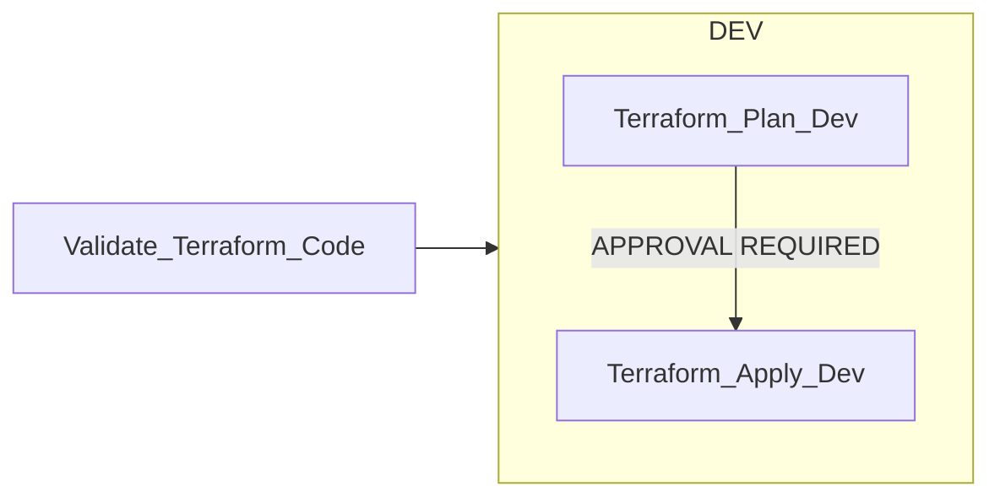
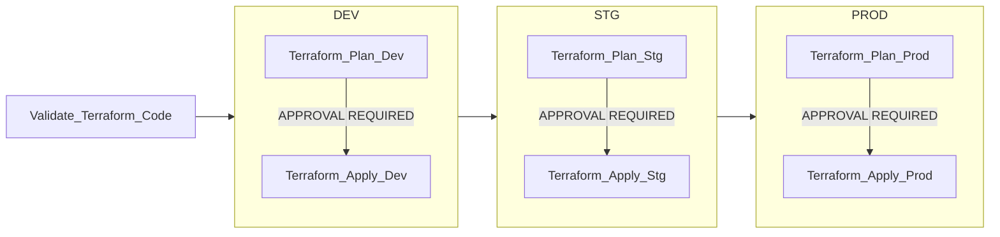

# vh-infra-wowza
This project deploys the infrastructure for the Wowza components used within VH. 

The infrastrucure mainly consists of load balancers routing traffic to Linux VMs running the Wowza software. There is also a storage account that stores the recordings. For more information about the Wowza solution please see [here](https://tools.hmcts.net/confluence/x/Nos7Xw)

## Environments
This projects follows the main environments for VH, as shown in the following:

| Environment  | Use | Location | 
| - | - | - | 
| `DEV` | Used as the main environment for development | [vh-infra-wowza-dev](https://portal.azure.com/#@HMCTS.NET/resource/subscriptions/867a878b-cb68-4de5-9741-361ac9e178b6/resourceGroups/vh-infra-wowza-dev/overview) |
| `DEMO` | Used as an environment for demo & test tasks | [vh-infra-wowza-demo](https://portal.azure.com/#@HMCTS.NET/resource/subscriptions/c68a4bed-4c3d-4956-af51-4ae164c1957c/resourceGroups/vh-infra-wowza-demo/overview) |
| `ITHC` | Used as the main security test environment | [vh-infra-wowza-ithc](https://portal.azure.com/#@HMCTS.NET/resource/subscriptions/ba71a911-e0d6-4776-a1a6-079af1df7139/resourceGroups/vh-infra-wowza-ithc/overview) |
| `STG` | Used as a pre-prod type environment and for end-to-end/load testing | [vh-infra-wowza-stg](https://portal.azure.com/#@HMCTS.NET/resource/subscriptions/74dacd4f-a248-45bb-a2f0-af700dc4cf68/resourceGroups/vh-infra-wowza-stg/overview) |
| `PROD` | Used as production | [vh-infra-wowza-prod](https://portal.azure.com/#@HMCTS.NET/resource/subscriptions/5ca62022-6aa2-4cee-aaa7-e7536c8d566c/resourceGroups/vh-infra-wowza-prod/overview) |

## Pipeline
This project uses Azure DevOps to run the pipelines for deploying the infrastructure.

[hmcts.vh-infra-wowza](https://dev.azure.com/hmcts/Video%20Hearings/_build?definitionId=686)

This pipeline is triggered during PRs and when merged in to the `master` branch. The following defines the stages used:

- `Validate_Terraform_Code`
  - Runs basic terraform file validation and format checking
  - Scans the TF config with TFsec  

- `Terraform_Plan_<ENV>`
  - Remove any resource lock
  - Gets secrets from AKV
  - Gets SP details for networking service connection 
  - Accept Wowza usage policy to use the image
  - Set vars for TF
  - TF init/plan
  - Publish TF plan output

- `Terraform_Apply_<ENV>`
  - Download TF plan artifact
  - Gets secrets from AKV
  - TF init/apply
  - Ensure lease on statefile is broken
  - `ApplyExtToEnv` - Gets settings for OMS agent. Installs OMS agent on VMs
  - `MonitoringTasks` - Gets and set authentication for Dynatrace

### PR run

When triggered via a PR the following stages will run:

### Master run

When triggered via a merge to `master` or manually triggered from the `master` branch the following stages will run (see above for details of each stage):

